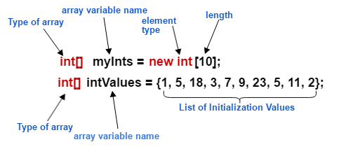

# Arrays

- An array is a structured collection or container object that stores a set quantity of elements all of the same data type.
- The length of an array is established when the array is created.
- Its length is fixed.
  

## Basic Declaration:

```java

// Declare an array of integers
int[] numbers;

// This declares an array variable named numbers that can hold integers.

```

## Declaration with Initialization:

```java

// Declare and initialize an array of strings
String[] names = new String[5];

// Here, names is an array of strings with a size of 5. The elements are initialized to null because arrays in Java are initialized with default values (0 for numeric types, false for boolean, and null for reference types like String).

```

## Inline Initialization:

```java

// Declare and initialize an array inline
double[] scores = { 98.5, 76.2, 88.0, 91.5 };

// This declares and initializes an array of double values in one line. Java infers the size of the array from the number of elements provided in the initialization.

```

## Anonymous Array Initialization:

```java
// Anonymous array initialization
int[] primes = { 2, 3, 5, 7, 11 };

// This declares an array of prime numbers. The array primes has its size determined implicitly by the number of elements provided in the curly braces {}.

```

## Multi-dimensional Array Declaration:

```java
// Declare a 2D array
int[][] matrix;

```
