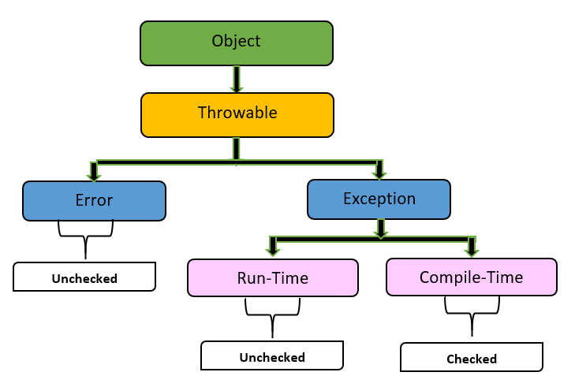

# Exception Handling with reference to object modeling in java

`Exception handling` in the context of object modeling is a crucial aspect of robust software design.

It involves anticipating, detecting, and responding to runtime errors in a way that maintains the integrity of the application and provides meaningful feedback to the user or calling code.

## 1. Understanding Exceptions

Exceptions are events that disrupt the normal flow of program execution. They can arise from various issues, such as invalid user input, network failures, or resource unavailability. In object-oriented design, exceptions can be modeled as objects themselves, encapsulating information about the error.

## 2. Exception Handling Mechanism

**The typical exception handling mechanism involves:**

- `Throwing Exceptions`: When an error condition arises, an exception is `"thrown."` This typically involves creating an instance of an exception class and passing relevant information (like error messages or error codes).

- `Catching Exceptions`: The thrown exception can be caught using `try-catch` blocks, allowing the program to handle the error gracefully instead of `crashing`.

- `Finally Block`: A finally block can be used to execute code that must run regardless of whether an exception occurred, such as releasing resources.

## 3. Object Modeling of Exceptions

In object-oriented design, exceptions can be treated as first-class objects. Here's how to model exceptions effectively:

**a. Custom Exception Classes**

1. `Inheritance`: Create a hierarchy of custom exception classes that extend standard exception classes. This allows for more specific error handling and categorization.

```java
public class MyAppException extends Exception {
    public MyAppException(String message) {
        super(message);
    }
}

public class DataNotFoundException extends MyAppException {
    public DataNotFoundException(String message) {
        super(message);
    }
}
```

**b. Encapsulation of Error Information**

- `Attributes`: Custom exceptions can encapsulate additional attributes, such as error codes, timestamps, or even the state of the application when the error occurred.

```java
public class MyAppException extends Exception {
    private int errorCode;

    public MyAppException(String message, int errorCode) {
        super(message);
        this.errorCode = errorCode;
    }

    public int getErrorCode() {
        return errorCode;
    }
}
```

## 4. Exception Handling in Object-Oriented Design

- a. `Layered Architecture`
  In layered architectures, exceptions can propagate up the layers. For example, lower layers (data access) may `throw exceptions` that higher layers (business logic) catch and handle accordingly. This separation of concerns keeps error handling organized.

- b. `Use of Interfaces`
  Define interfaces for classes that can throw exceptions. This allows you to standardize error handling across different implementations.

## Types of Exceptions

Java has two main categories of exceptions:

- `Checked Exceptions`: These are checked at `compile-time`. Classes that extend Exception (except for `RuntimeException` and its subclasses) are checked exceptions.
- `Unchecked Exceptions`: These are not checked at `compile-time` and include errors that extend `RuntimeException`.




## What are Checked exceptions?
The exceptions that are subtypes of `Exception` (`exclude subtypes of RuntimeException`) are categorized as checked exceptions. When we use code that can `throw checked exceptions`, we must handle them, otherwise the compiler will complain.

## What are Unchecked exceptions?

In contrast, we don’t have to catch *unchecked exceptions* which are subtypes of `Error` and `RuntimeException`. Methods also don’t have to declare to throw unchecked exceptions. It’s because programs typically cannot be recovered from unchecked exceptions.