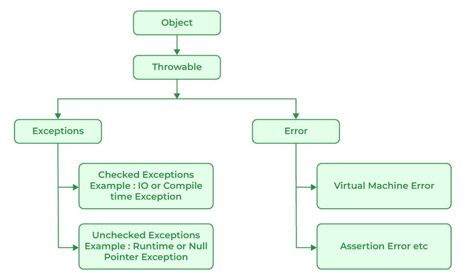

# Exceptions Handling in Java

Exception handling in java is one of the important means to handle runtime errors so that the regular flow of the application can be maintained.

Thus it is a concept to handle runtime errors such as ClassNotFoundException, IOException, SQLException RemoteException, etc.

# Major reasons why an exception Occurs:

- Invalid user input 
- Device failure 
- Loss of network connection
- Physical limitations (out-of-disk memory)
- Core errors
- Opening an unavailable file

## Exception Hierarchy:

All exception and error types are subclasses of the class Throwable, which is the base class of the hierarchy. One branch is headed by Exception. This class is used for exception conditions that users programs should catch.

Types of exceptions

1. User Defined Exceptions
2. Built-in Exception
    - Checked Exceptions
        - ClassNotFoundExcepiton
        - interruptedException
        - InstantiationException
        - IOException
        - SQLException
        - FileNotFoundException
    - Unchecked Exceptions
        - ArthmeticException
        - ClassCastException
        - NullPointerException
        - ArrayStoreException
        - ArrayIndexOutOfBoundException
        - IllegalThreadStateException