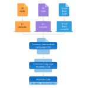

# Architecture of .NET Framework

The two major components of .NET Framework are the Common Language Runtime and the .NET Framework Class Library.

- The Common Language Runtime (`CLR`) is the execution engine that handles running applications. It provides services like thread management, `garbage collection`, type-safety, exception handling, and more.

- The Class Library provides a set of APIs and types for common functionality. It provides types for `strings`, `dates`, `numbers`, etc. The Class Library includes APIs for reading and writing files, connecting to databases, drawing, and more.

.NET applications are written in the `C#`, F#, or Visual Basic programming language. Code is compiled into a language-agnostic Common Intermediate Language (`CIL`). Compiled code is stored in assemblies—files with a `.dll` or `.exe` file extension.