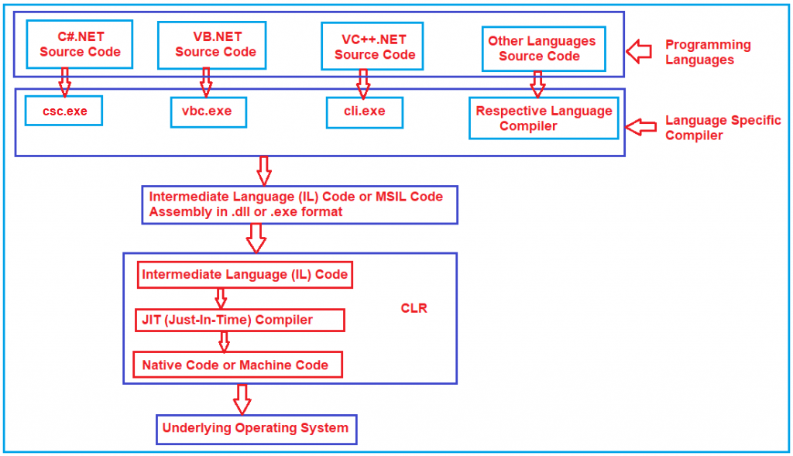

# What is JIT

JIT stands for the Just-in-Time compiler. It is the component of CLR that is responsible for converting `MSIL code into Native Code`. Native code is the code that is directly understandable by the operating system.

## What is not .NET?

- .NET is not an Operating system.
- It is not an application or package.
- .NET is not a database
- It is not an ERP application.
- .NET is not a Testing Tool.
- It is not a programming language.

## How is a .NET Application Compiled and Run?

## Common Language Runtime (CLR) in .NET Framework:

CLR is the heart of the .NET Framework and it contains the following components.

- Security Manager
- JIT Compiler
- Memory Manager
- Garbage Collector
- Exception Manager
- Common Language Specification (CLS)
- Common Type System (CTS)
