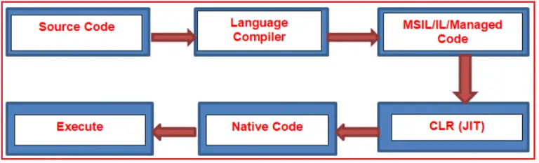

# Common Language Runtime (CLR):

`CLR` stands for Common Language Runtime and it is the core component under the .NET framework which is responsible for converting the `MSIL` (Microsoft Intermediate Language) code into native code and then provides the runtime environment to execute the code. 

That means Common Language Runtime (`CLR`) is the execution engine that handles running applications. 
It provides services like `thread management`, `garbage collection`, `type safety`, exception handling, and more. 

**In the .NET framework, the Code is Compiled Twice**

- In the 1st compilation, the source code is compiled by the respective language compiler and generates the intermediate code which is known as MSIL (`Microsoft Intermediate Language`) or IL (`Intermediate language code`) Or Managed Code.
- In the 2nd compilation, `MSIL` code is converted into Native code (native code means code specific to the Operating system so that the code is executed by the Operating System ) and this is done by `CLR`.

> Always 1st compilation is slow and 2nd compilation is fast.